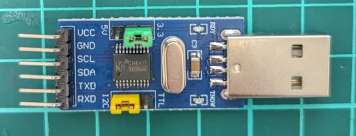
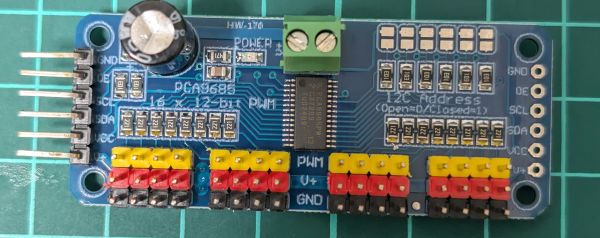
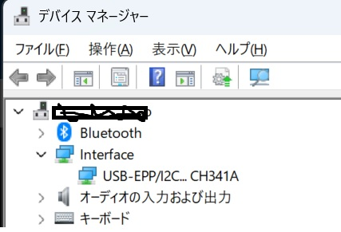
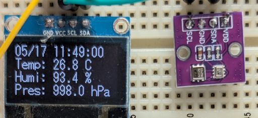

Raspberry piやESPシリーズなどの組み込みシステムの制御に適したマイコンには、GPIO,I2CやSPIなどのポートが備わってるのが特徴の一つです。これらのI/Fを通じて様々なセンサー（例えば温度、湿度、気圧など）や小型表示器、PWM制御器などに接続できます。  

一方、WindowsPCなどに広く使われているx86には、残念ながらセンサーなどのハードウェアを直接制御可能なポートがありません。 
PCにはUSBポートがありますが、このUSBポートからシリアルやI2Cへ変換するハードウェアを探してみたらCH341Tがamazonなどで安価に販売されていました。

そこで、USBからCH341T経由で、次のような機能を試してみました。  
(1)AHT20で温度、湿度のデータを取得  
(2)OLEDディスプレイSSD1306へ文字表示  
(3)PCA9685でサーボモータを駆動  

## 利用したパーツとテストした機能   
(0)CH341T USBからI2Cへ変換  
   
(1)AHT20で温度、湿度のデータを取得  
(2)OLEDディスプレイSSD1306へ文字表示  
(3)PCA9685でサーボモータを駆動  
   
## ドライバーの入手とインストール  
  CH341SER  
　入手先：https://www.wch-ic.com/downloads/ch341ser_exe.html  
　ドライバーがインストールされるとWindowsデバイスマネージャーで次のように表示されます。  
   

## pythonモジュール i2cpy と接続されているI2Cデバイスの列挙  

from i2cpy import I2C  
i2c = I2C(driver="ch341")  
devices = i2c.scan()  # I2Cバス上のデバイスをスキャン  
print("検出されたI2Cデバイスアドレス:", [hex(addr) for addr in devices])  

## AHT20/BMP280で取得した温度、湿度、気圧データを日時を含めてSSD1306での表示例  
   
